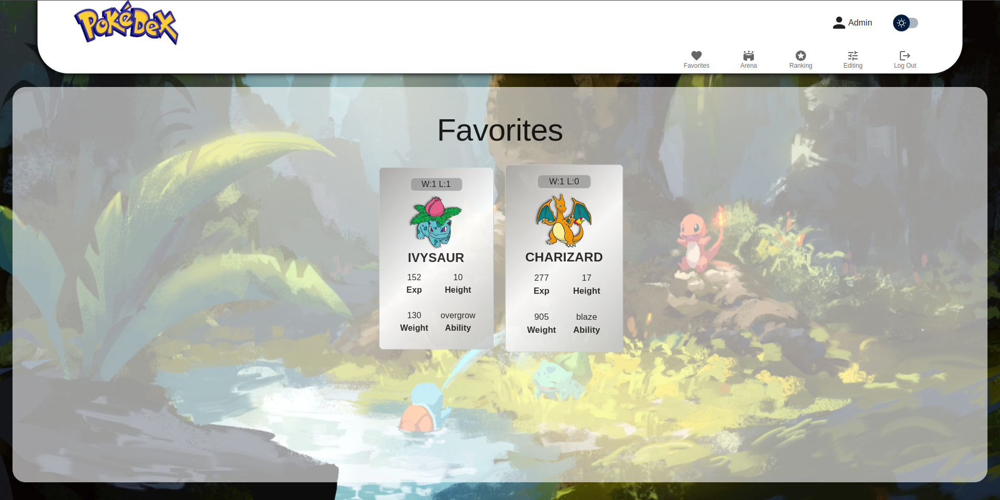

# **Pokedex**

---

## **How to Run the Application?**

- **Clone the repository:**
  `git clone https://github.com/PatGaj/Pokedex.git`
- **Navigate to the directory:**
  `cd Pokedex`
- **Install dependencies:**
  `npm install`
- **Run JSON server:**
  - **Install JSON-server:**
    `npm install json-server@0.17.4`
    (_Global installation:_ `npm install -g json-server@0.17.4`)
  - **Start the server:**
    `json-server --watch src/services/db.json`
- **Start the application in a separate terminal:**
  `npm run dev`
- **Open the link provided in the terminal by Vite:**
  **_For example:_** `Local: http://localhost:5173/`

---

## **Features**

### **Registration and Login**

- **Registration:** Allows users to create a new account.
- **Login:** Enables users to log into an existing account using an email and password.
- **Logout:** Log out of the application.

### **Pokemon Interactions**

- **Create New Pokemon:**  
   Creating a new Pokemon requires the following details:
  - _name_
  - _weight_
  - _height_
  - _base experience_
  - _selecting a Pokemon image from available sprites_
- **Edit Pokemon:** Allows modifying the _weight_, _height_, and _base experience_ of a Pokemon.
- **Add to Favorites:** Enables users to mark Pokemons as favorites and view them in a dedicated section.
- **Battles in the Arena:** Users can engage their Pokemons in battles.

### **Arena**

- **Add Pokemon to the Arena:** Allows adding two Pokemons to the battle arena.
- **Conduct Battles:** Determines the winner based on Pokemon attributes.
- **Update Stats:** The winning Pokemon receives +10 Exp.

### **Ranking**

- **Sort Pokemon:** Users can sort Pokemon by various attributes such as experience, weight, height, or number of wins.

### **Personalization**

- **Light/Dark Theme:** A toggle to switch between light and dark themes.
- **Responsiveness:** The interface adapts to different screen resolutions.

---

## **Project Conventions**

### **Naming**

- **Variables, Directories, Components, Functions:** Follow **PascalCase**, e.g., `baseExperience`.
- **API and JSON-server Data:** Use **snake_case**, e.g., `base_experience`.

### **Styling**

- **Material-UI `sx`:** Component styling is primarily handled using dynamic `sx` styles.
- **Responsiveness:** Styling incorporates Material-UI `breakpoints`, ensuring the application is responsive on different devices.

### **Validation**

- Forms are managed using **React Hook Form** with validation powered by **Zod**.

### **Notifications**

- Notifications are implemented using the **Notistack** library.

### **Folder Structure**

The project is divided into the following parts:

- **`components/`**: Contains all user interface components.
- **`components/subpages/`**: Includes main application views such as Home, Arena, and Favorites.
- **`components/shared/`**: Contains reusable components, e.g., `Tile`.
- **`context/`**: Manages application-wide state using React Context API.
- **`hooks/`**: Custom hooks managing component behaviors.
- **`services/`**: Includes additional functionalities necessary for the application.

---

## **Screenshots**

Light theme view with pokemons cards:

Dark theme:

Registration form:

Main user view:

Arena view after fight:

Ranking:

Create new pokemon form:

Favorites Pokemons:

